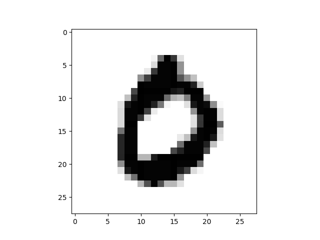

# TensorFlow

- end-to-end open source platform for machine learning.
- working with tensors , ehich mathematically is an algebraic object that describes a (multilinear) relationship between sets of algebraic objects related to a vector space.

It can build and train models using keras, iterate and debug . It builds Neural networks for ML . 

install tensorflow using pip 
```
pip install tensorflow
```

Libs 
```
pip install numpy
pip install pandas  
pip install matplotlib 
```

test import them in cmd python
```
> python 
import tensorflow as tf
from tensorflow import keras
import numpy as np
import pandas as pd
import matplotlib.pyplot as plt
from sklearn import preprocessing
```

### Proj 1 : neural network that classifies images.

step 1. Downlad handwriten digits dataset from MNIST using googleapis
ref - http://yann.lecun.com/exdb/mnist/

**Data Collection**
Convert the samples from integers to floating-point numbers:
```
mnist = tf.keras.datasets.mnist
(x_train, y_train), (x_test, y_test) = mnist.load_data()
x_train, x_test = x_train / 255.0, x_test / 255.0
```

**Build Model**
Build the tf.keras.Sequential stack layers
```
model = tf.keras.models.Sequential([
  tf.keras.layers.Flatten(input_shape=(28, 28)),
  tf.keras.layers.Dense(128, activation='relu'),
  tf.keras.layers.Dropout(0.2),
  tf.keras.layers.Dense(10)
])
```

check the vectot of logits ( non normalized / raw predictions that classification model generates) . the logits is paased to a normalization function such as softmax to geneeate a vector of normalized probabilities .  
and 
logods ( log of odds of event ie ratio of probabaility of success p to proabaility of failure 1-p ,  p / 1-p )
```
predictions = model(x_train[:1]).numpy()
array([[ 0.34590665, -0.51501477,  0.34438032,  0.656325  , -0.28661215,
         0.00935765,  0.51382446, -0.17815022, -0.04149181, -0.1331951 ]],
      dtype=float32)
```

tf.nn.softmax function converts these logits to "probabilities" for each class:
```
tf.nn.softmax(predictions).numpy()
array([[0.12339833, 0.0521694 , 0.12321012, 0.16831477, 0.06555561,
        0.08813488, 0.14596039, 0.07306582, 0.08376532, 0.07642545]],
      dtype=float32)
```

Although softmax is directly interpretable for some modelas it cannot povide an exact and numerically stable loss function for all models 

Hence we calculate the loss function which is zero signifies the correct class 
```
loss_fn = tf.keras.losses.SparseCategoricalCrossentropy(from_logits=True)
loss_fn(y_train[:1], predictions).numpy()
model.compile(optimizer='adam',
              loss=loss_fn,
              metrics=['accuracy'])
model.fit(x_train, y_train, epochs=5)
```
see the incremental results after adjusting modal parameters to minimizee loss from epcah one 0.91 to epoch 5 0.97
```
Train on 60000 samples
Epoch 1/5
60000/60000 [==============================] - 3s 53us/sample - loss: 0.2965 - accuracy: 0.9137
Epoch 2/5
60000/60000 [==============================] - 3s 57us/sample - loss: 0.1433 - accuracy: 0.9584
Epoch 3/5
60000/60000 [==============================] - 4s 63us/sample - loss: 0.1091 - accuracy: 0.9676
Epoch 4/5
60000/60000 [==============================] - 4s 71us/sample - loss: 0.0874 - accuracy: 0.9728
Epoch 5/5
60000/60000 [==============================] - 4s 60us/sample - loss: 0.0760 - accuracy: 0.9763
```
check the performance of model on test set 
```
model.evaluate(x_test,  y_test, verbose=2)
```
the outout shows ~=0.98 accuracy
```
10000/10000 - 0s - loss: 0.0762 - accuracy: 0.9763
[0.07620442808587104, 0.9763]
```

To further return a probaility apply softmax on model 
```

```
**selftest**

Digit's image at index of xtest 3 is 0 

image  
you can edit array index in script show_mnist_handwritten_digits_image.py and run to get and store the image

and the label on y_test[3] says 0 as well
```
y_test[3]
0
```

lets check digit img ar position 3 with the predicted results 
```
>>> probability_model(x_test[:3])
   [9.9985933e-01, 3.7119894e-11, 1.1895904e-04, 4.9979627e-07,
        3.8895456e-07, 6.6416396e-07, 1.2701520e-05, 6.1525652e-06,
        9.6602575e-09, 1.2553021e-06],
```
the probaility at zeroth index being the highest 9.9985933e-01, , hence image correctly predicted as 0


### Proj 2 : model to try to predict whether a Pokémon is a legendary Pokémon
using kaggle db for data miniming on pokemon - https://www.kaggle.com/alopez247/pokemon

### Proj 3: ML is a classifier trained over the Fashion MNIST dataset

dataset compromises of 70,000 grayscale images of articles of clothing.
The greyscale values for a pixel range from 0-255 (black to white). Each low-resolution image is 28x28 pixels

```
fashion_mnist = keras.datasets.fashion_mnist
(train_images, train_labels), (test_images, test_labels) = fashion_mnist.load_data()
```

Labels are as foloows 

Label	Class
0	T-shirt/top
1	Trouser
2	Pullover
3	Dress
4	Coat
5	Sandal
6	Shirt
7	Sneaker
8	Bag
9	Ankle boot

2. Build the tf.keras.Sequential model by stacking layers.

**Preprocessing the dataset**
Greyscale assigned to each pixel within an image has a value range of 0-255. To flatten each image is stored as a 2-dimensional array where each numerical value in the array is the greyscale code of particular pixel. 
```
>>> train_images = train_images / 255.0
>>> test_images = test_images / 255.0
```

**Model Generation** 
Every NN is constructed from a series of connected layers that are full of connection nodes and have its own particular mathematical operation
This models uses 3 layers 
Layer 1 - take an image and format the data structure in a method acceptable for the subsequent layers such as take multidemsion and produce sinngle dimension ( flatten ) . 
Layer 2 - Dense layers with 128 node uses Rectified Linear Unit (ReLU) Activation Function that outputs values between zero and 1
Layer 3 - Dense layers with 10 node uses softmax activation function to outpupt probabilities , scales everything to add up to 1.

```
model = keras.Sequential([ keras.layers.Flatten(input_shape=(28,28)), 
keras.layers.Dense(128, activation=tf.nn.relu), 
keras.layers.Dense(10, activation=tf.nn.softmax)])
```

**Training the Model**
before training define models optimizer , loss function and metrics . 
```
model.compile( optimizer = 'adam', loss = 'sparse_categorical_crossentropy', metrics = ['accuracy'])
```
train the model with our Flatten array , correct classification and  number of epochs undertaken
```
model.fit(train_images, train_labels, epochs=5)
```
Observe the progress with eveery testing cycle 
```
Epoch 1/5
60000/60000 [==============================] - 3s 45us/sample - loss: 0.4995 - acc: 0.8244
Epoch 2/5
60000/60000 [==============================] - 2s 41us/sample - loss: 0.3721 - acc: 0.8654
Epoch 3/5
60000/60000 [==============================] - 3s 53us/sample - loss: 0.3348 - acc: 0.8788
Epoch 4/5
60000/60000 [==============================] - 3s 46us/sample - loss: 0.3119 - acc: 0.8866
Epoch 5/5
60000/60000 [==============================] - 4s 61us/sample - loss: 0.2925 - acc: 0.8928
```
softmax activation function of the final output layer will provide a probability that the image belongs to each of the 10 label categories.

**Evaluating the Model**
After obtaining a functional and trained NN model, evaluate model . Find test accuracy
```
test_loss, test_acc = model.evaluate(test_images, test_labels)
```
you can outout the loss and accuracy 
```
>>> test_loss
0.36592924320697784
>>> test_acc
0.8663
```

Feed test exmaples from the test array . 
```
predictions = model.predict(test_images)
```
Observer for a single result predicted , most value are closer to zero , with raised to exponenets such as e-06 . however the value 9.6431386e-01 is more close to 1 ie 96.43% hence it classofies under label with index 9
```
 predictions[0]
array([1.6079561e-05, 3.8696378e-08, 3.3632841e-07, 9.7230007e-08,
       9.6133635e-06, 1.1564302e-02, 2.6221289e-06, 2.4083924e-02,
       9.1205711e-06, 9.6431386e-01], dtype=float32)

```
Can look through a list to determine the class label , hence the prediction is label 9
```
>>> numpy.argmax(predictions[0])
9
```
Finally, we can verify this prediction by looking at the label ourselves, indeed this object had label 9 
```
>>> test_labels[0]
9
```

### Proj 4: Visualization for proj 3 ML is a classifier trained over the Fashion MNIST dataset


##  debugging 

**Issue 1**  Outdated python version 

If you have python v2 installed such as 2.7 and u get warning like 
```
DEPRECATION: Python 2.7 reached the end of its life on January 1st, 2020. Please upgrade your Python as Python 2.7 is no longer maintained. pip 21.0 will drop support for Python 2.7 in January 2021. More details about Python 2 support in pip, can be found at https://pip.pypa.io/en/latest/development/release-process/#python-2-support
```
**Solution** set python alias and update pyton 
open bash_cliases file 
```
vi ~/.bash_aliases
```
and add alias for python version 
```
alias python=python3
```
implement the changes 
```
source ~/.bash_aliases
```
recheck python version , it should be 3xx
```
python --version       
Python 3.6.9
```

**Issue2** pip outdated
**solution** as described above check pip version and make an alias 
```
> pip3 --version
pip 9.0.1 from /usr/lib/python3/dist-packages (python 3.6)
➜  TensorFlow-Pokemon-Course git:(master) pip --version 
\WARNING: pip is being invoked by an old script wrapper. This will fail in a future version of pip.
Please see https://github.com/pypa/pip/issues/5599 for advice on fixing the underlying issue.
To avoid this problem you can invoke Python with '-m pip' instead of running pip directly.
pip 20.1.1 from /home/altanai/.local/lib/python2.7/site-packages/pip (python 2.7)
```
